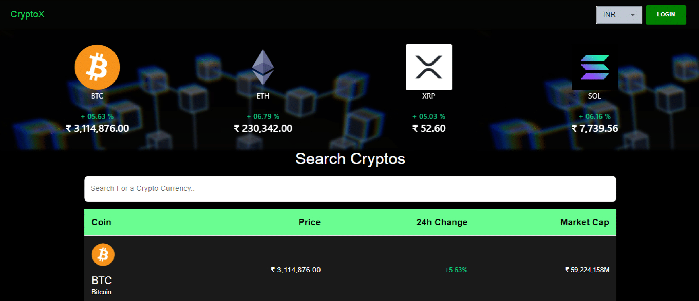
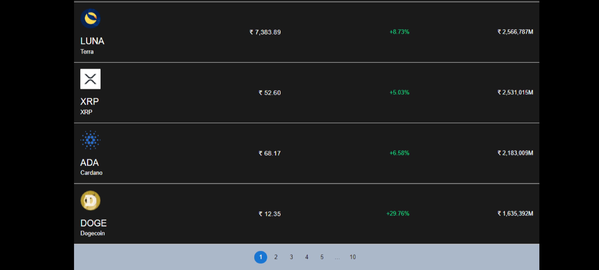
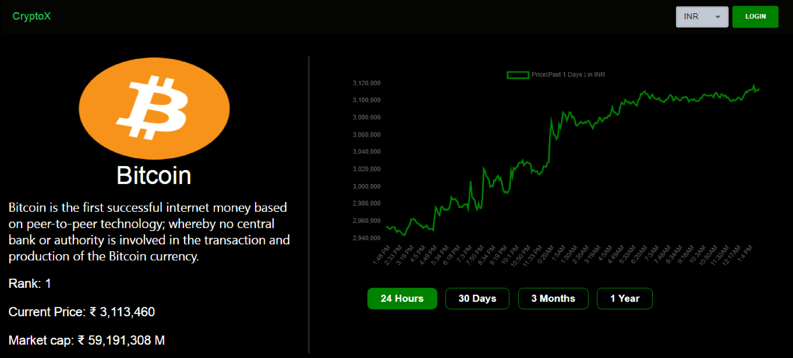

<h1 align=center>CryptoX  <a href="https://cryptox2.vercel.app/">LIVE</a> </h1>

## The _CoinGecko_ API is used by this **CryptoX** to get real-time crypto data. It allows you to choose between the INR and the USD as your _currency_. It also displays the most popular cryptos, together with their profit and loss percentages. We acquire a list of hundreds of cryptos with some info using the _CoinGecko Coinlist_ API. We used _Chart.js_ to display a crypto price chart throughout time periods of 1 day, 30 days, 3 months, and a year. I also utilized _firebase authentication_ and _firestore_ to authenticate the user and let them to save their favorite cryptos on a watchlist.
---
### Tech Stack used:
- CoinGecko APIs (For fetching data)
- Chartjs (For price chart)
- Material UI ( For components)
- Firebase AUth (For Authentication)
- Firebase Firestore (For storing data)
- Vercel (For Hosting)
- and some other lib..
---

---
### Contact me:

#### [Twitter](https://twitter.com/Vanshsh2701)

#### [LinkedIn](https://www.linkedin.com/in/vanshsharma27/)
