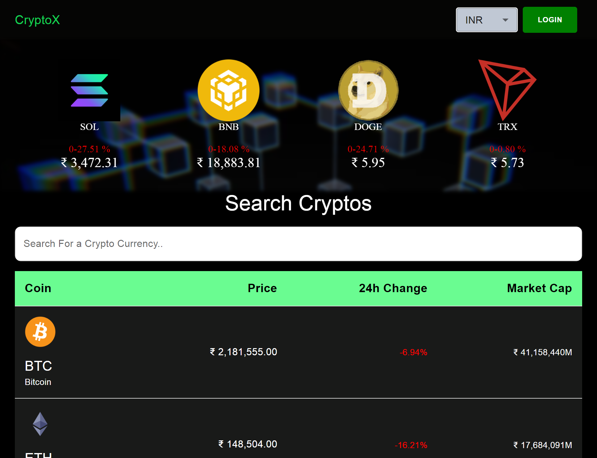
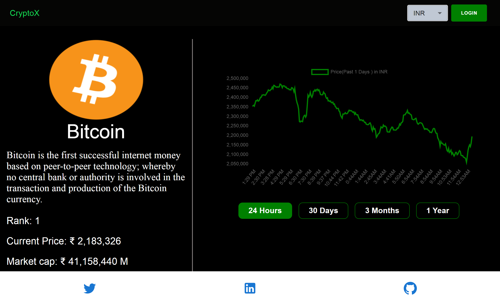
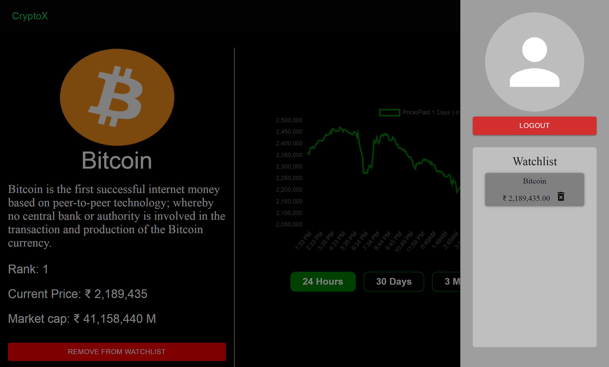

# 📃 CryptoX ( [LIVE DEMO](https://cryptox2.vercel.app/) )

Get the most up-to-date information on the most popular Cryptos, as well as a list of hundreds of Cryptos with recent price fluctuations. You can also get a performance graph for 24 hours, 30 days, 3 months, and 1 year.

##

## 📦 Features

-   Live Trending Cryptos
-   List of Cryptos with the data
-   Performance Graph for (1 Day, 30 Days, 3 Months, 1 Year)
-   Authentication using Firebase
-   Login Options using (Google, GitHub, Anonymous)
-   Option to add/remove the favorite Cryptos from the watchlist

## 👨‍💻 Tech Stack

**Frontend:**  

**Backend:** 

**Host:** 

**Other Resources:**   

## 📖 Lessons Learnt:

While building this project I learnt various things such as:

-   Working with Material UI
-   Working with multiple APIs and fetching Data
-   Authnetication and Fetching Data from Firebase
-   Working with Chartjs

## 📷 Screenshots

## ⏲️ Roadmap

-   Add Dark/Light theme for Website
-   Add more data columns

## 🔗 Contact

