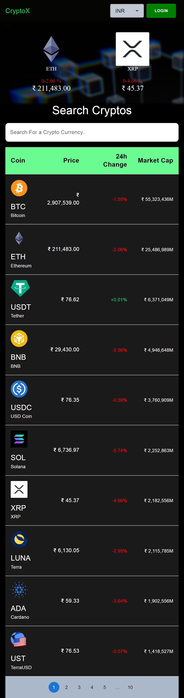
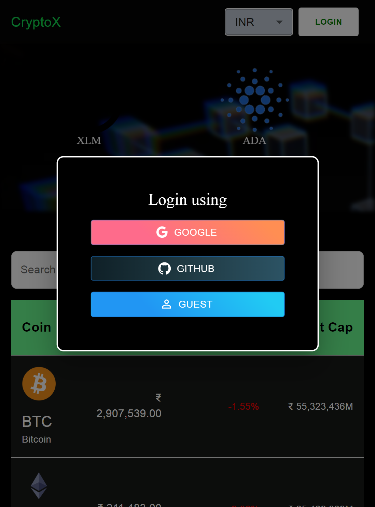
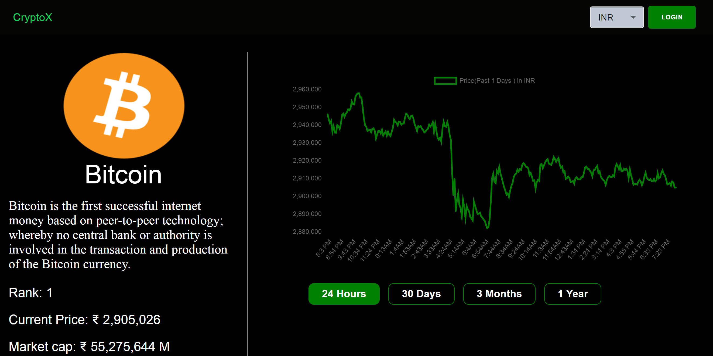
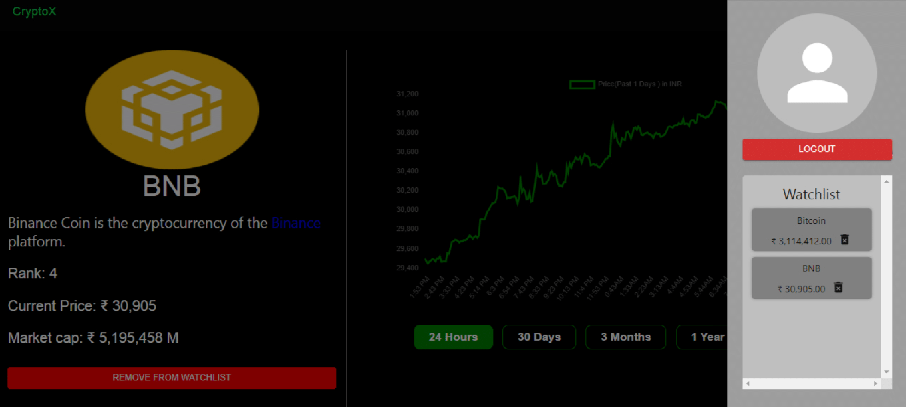

# CryptoX  ( [LIVE DEMO](https://cryptox2.vercel.app/) )

Learn about the most popular Cryptos and a list of hundreds of Cryptos with price changes in the last 24 hours. Get the performance graph as well, with options for 24 hours, 30 days, 3 months, and 1 year. 
## Badges

 

## Features

- Live Trending Repo
- List of Cryptos with the data
- Performance Graph for (1 Day, 30 Days, 3 Months, 1 Year)
- Login Options using (Google, GitHub, Anonymous)
- Option to add/remove the favorite Cryptos from the watchlist

## Tech Stack

**Client:** React, MaterialUI, Chart.js, React-Alice-Carousel

**Server:** Firebase

**Some other packages:** React-HTML-Parse, React-Error-Boundary

## Lessons Learned
While building this project I learnt various things such as:
- Working with Material UI
- Working with multiple APIs
- Authnetication and Fetching Data from Firebase

## Screenshots

## Demo

Insert gif or link to demo

## 🔗 Contact

